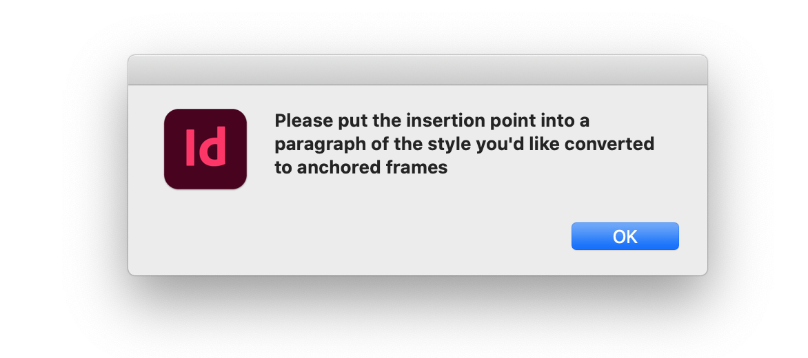
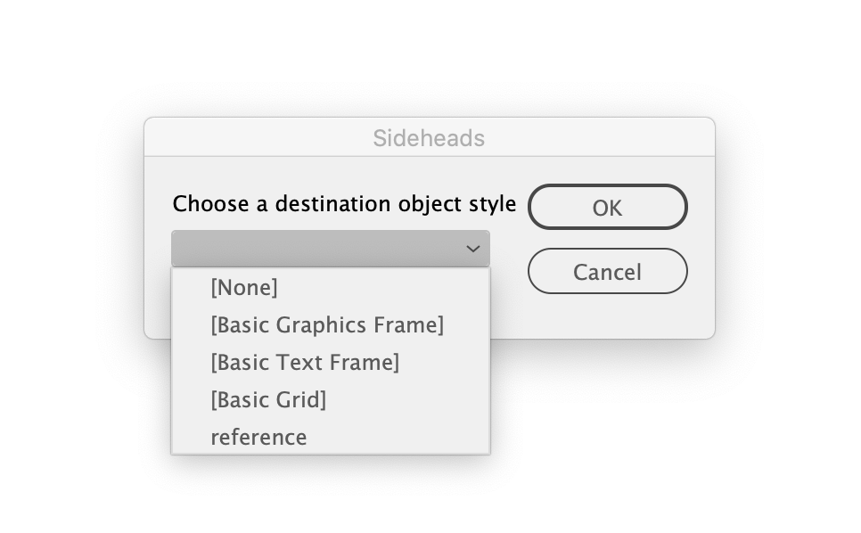

# Sideheads for Indesign

## Thanks to
* [sidpalas](https://community.adobe.com/t5/photoshop/console-log-shim/td-p/9923125?page=1) for error logging to socket
* [Laubender](https://community.adobe.com/t5/indesign/set-all-text-frame-object-style-to-none/m-p/9913234#M103431) for applying object style
* [Flavio Copes](https://flaviocopes.com/how-to-remove-last-char-string-js/) for trim a character off a string
* [clankill3r](https://stackoverflow.com/questions/26908750/fit-frame-to-content-after-changing-its-contents) for fitting frame to content
* [Indesign Secrets](https://indesignsecrets.com/add-undo-to-your-script.php) for one-step undo
